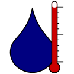

<p align="center"></p>

# PsychroLib
[](https://travis-ci.com/psychrometrics/Libraries)

Psychrometric is the study of physical and thermodynamic properties of moist air. These properties include, for example, the air's dew point temperature, its wet bulb temperature, relative humidity, humidity ratio, enthalpy.

PsychroLib is a library of functions to enable calculating psychrometric properties of moist and dry air. The library is available for Python, C, Fortran, JavaScript, and Microsoft Excel Visual Basic for Applications (VBA). The functions are based of formulae from the  2017 ASHRAE Handbook — Fundamentals, Chapter 1. Functions can be grouped into two categories:

1. Functions for the calculation of dew point temperature,
    wet-bulb temperature, partial vapour pressure of water, humidity
    ratio or relative humidity, knowing any other of these and dry bulb
    temperature and atmospheric pressure;

2. Functions for the calculation of other moist air properties. All these use the
    humidity ratio as input.

Relationships between these various functions are illustrated in Figure 1. To compute a moist air property such as enthalpy, knowing a humidity parameter such as dew point temperature, one first has to compute the humidity ratio from the dew point temperature, then compute the enthalpy from the humidity ratio. The functions in point (1) above include primary relationships corresponding to formulae from the ASHRAE Handbook, and secondary relationships which use a combination of primary relationships to calculate the result. For example, to compute dew point temperature knowing the partial pressure of water vapor in moist air, the library uses a formula from the ASHRAE Handbook (primary relationship). On the other hand to compute dew point temperature from relative humidity, the library first computes the partial pressure of water vapor, then computes the dew point temperature (secondary relationship). Primary relationships are shown with bold double arrows in Figure 1.

<p align="center"></p>
<p align="center"><b>Figure 1</b> - Psychrometric relationships.</p>

## Features
The following psychrometric functions are currently available in PsychroLib across all supported languages:

|Function Name|Description|
|-------------|-----------|
|`GetTRankineFromTFahrenheit`|Utility function to convert temperature to degree Rankine given temperature in degree Fahrenheit.|
|`GetTKelvinFromTCelsius`|Utility function to convert temperature to Kelvin given temperature in degree Celsius.|
|`GetTWetBulbFromTDewPoint`|Return wet-bulb temperature given dry-bulb temperature, dew-point temperature, and pressure.|
|`GetTWetBulbFromRelHum`|Return wet-bulb temperature given dry-bulb temperature, relative humidity, and pressure.|
|`GetRelHumFromTDewPoint`|Return relative humidity given dry-bulb temperature and dew-point temperature.|
|`GetRelHumFromTWetBulb`|Return relative humidity given dry-bulb temperature, wet bulb temperature and pressure.|
|`GetTDewPointFromRelHum`|Return dew-point temperature given dry-bulb temperature and relative humidity.|
|`GetTDewPointFromTWetBulb`|Return dew-point temperature given dry-bulb temperature, wet-bulb temperature, and pressure.|
|`GetVapPresFromRelHum`|Return partial pressure of water vapor as a function of relative humidity and temperature.|
|`GetRelHumFromVapPres`| Return relative humidity given dry-bulb temperature and vapor pressure.|
|`GetTWetBulbFromHumRatio`|Return wet-bulb temperature given dry-bulb temperature, humidity ratio, and pressure.|
|`GetHumRatioFromTWetBulb`|Return humidity ratio given dry-bulb temperature, wet-bulb temperature, and pressure.|
|`GetHumRatioFromRelHum`|Return humidity ratio given dry-bulb temperature, relative humidity, and pressure.|
|`GetRelHumFromHumRatio`|Return relative humidity given dry-bulb temperature, humidity ratio, and pressure.|
|`GetHumRatioFromTDewPoint`|Return humidity ratio given dew-point temperature and pressure.|
|`GetTDewPointFromHumRatio`|Return dew-point temperature given dry-bulb temperature, humidity ratio, and pressure.|
|`GetHumRatioFromVapPres`|Return humidity ratio given water vapor pressure and atmospheric pressure.|
|`GetVapPresFromHumRatio`|Return vapor pressure given humidity ratio and pressure.|
|`GetDryAirEnthalpy`|Return dry-air enthalpy given dry-bulb temperature.|
|`GetDryAirDensity`|Return dry-air density given dry-bulb temperature and pressure.|
|`GetDryAirVolume`|Return dry-air volume given dry-bulb temperature and pressure.|
|`GetSatVapPres`|Return saturation vapor pressure given dry-bulb temperature.|
|`GetSatHumRatio`|Return humidity ratio of saturated air given dry-bulb temperature and pressure.|
|`GetSatAirEnthalpy`|Return saturated air enthalpy given dry-bulb temperature and pressure.|
|`GetVaporPressureDeficit`|Return vapor pressure deficit given dry-bulb temperature, humidity ratio, and pressure.|
|`GetDegreeOfSaturation`|Return the degree of saturation (i.e humidity ratio of the air / humidity ratio of the air at saturation at the same temperature and pressure) given dry-bulb temperature, humidity ratio, and atmospheric pressure.|
|`GetMoistAirEnthalpy`|Return moist air enthalpy given dry-bulb temperature and humidity ratio.|
|`GetMoistAirVolume`|Return moist air specific volume given dry-bulb temperature, humidity ratio, and pressure.|
|`GetMoistAirDensity`|Return moist air density given humidity ratio, dry bulb temperature, and pressure.|
|`GetStandardAtmPressure`|Return standard atmosphere barometric pressure, given the elevation (altitude).|
|`GetStandardAtmTemperature`|Return standard atmosphere temperature, given the elevation (altitude).|
|`GetSeaLevelPressure`|Return sea level pressure given dry-bulb temperature, altitude above sea level and pressure.|
|`GetStationPressure`|Return station pressure from sea level pressure.|
|`CalcPsychrometricsFromTWetBulb`|Utility function to calculate humidity ratio, dew-point temperature, relative humidity, vapour pressure, moist air enthalpy, moist air volume, and degree of saturation of air given dry-bulb temperature, wet-bulb temperature, and pressure.|
|`CalcPsychrometricsFromTDewPoint`|Utility function to calculate humidity ratio, wet-bulb temperature, relative humidity, vapour pressure, moist air enthalpy, moist air volume, and degree of saturation of air given dry-bulb temperature, dew-point temperature, and pressure.|
|`CalcPsychrometricsFromRelHum`|Utility function to calculate humidity ratio, wet-bulb temperature, dew-point temperature, vapour pressure, moist air enthalpy, moist air volume, and degree of saturation of air given dry-bulb temperature, relative humidity and pressure.|

## Getting started
PsychroLib is available for Python, C, Fortran, JavaScript, and Microsoft Excel Visual Basic for Applications (VBA). A list of functions available in the library can be found in the [PsychroLib application programming interface (API) documentation](https://psychrometrics.github.io/psychrolib). The page provides a comprehensive description of all the functions available in PsychroLib. Although it describes the Python version of the library, PsychroLib uses a common API across all the supported language implementations.

### Installation instructions
If you are using Python, PsychroLib is available though the Python Package Index (PyPI) at https://pypi.org/project/PsychroLib. Assuming you have PyPI installed on your system, type the following in your command prompt:
```
pip install psychrolib
```

For all other languages, clone the repository or download the file directly from the repository, and include PsychroLib to your code according to the language specifications.

### Example usage
For examples on how to use PsychroLib in Python, C, Fortran, JavaScript, and Microsoft Excel Visual Basic for Applications (VBA) please see [this guide](docs/how-to-use-psychrolib.md).

## Contributing
If you would like to contribute to the PsychroLib project, clone this repository, make your changes, and create a pull request with a **clear description** of your changes. If your changes are merged, you will appear as one of our [Contributors](https://github.com/psychrometrics/psychrolib/graphs/contributors).

## Versioning
This project uses [semantic versioning](https://semver.org/).

## Copyright and licence
Copyright

- For the current library implementation
    Copyright (c) 2018 D. Thevenard and D. Meyer.
- For equations and coefficients published ASHRAE Handbook — Fundamentals, Chapter 1
    Copyright (c) 2017 ASHRAE Handbook — Fundamentals (https://www.ashrae.org)

Licence

- Licensed under the [MIT License](LICENSE.txt).

## Acknowledgements
Many thanks to Tom Worster ([tom--](https://github.com/tom--)) for his suggestions with the original JavaScript library implementation.