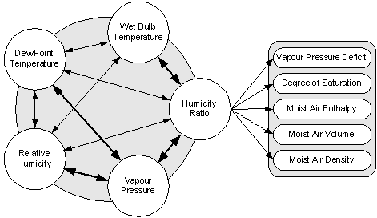

# Libraries of Psychrometric Functions in C, Fortran, VBA (Excel) and JavaScript

Psychrometrics are the determination of physical and thermodynamic properties of moist air. These properties include, for example, the air's dew point temperature, its wet bulb temperature, relative humidity, humidity ratio, enthalpy, etc.

The library of freeware functions in C, Fortran, VBA and JavaScript provided here enables the calculation of psychrometric properties of moist and dry air. The functions are based of formulae from the ASHRAE Handbook of Fundamentals, 2009 edition. They can be divided into two categories:

 1. Functions enabling the calculation of dew point temperature,
    wet-bulb temperature, partial vapour pressure of water, humidity
    ratio or relative humidity, knowing any other of these and dry bulb
    temperature and atmospheric pressure;
    
 2. Functions enabling the calculation of other moist air properties. All these use the
    humidity ratio as input.

Relationships between these various functions are illustrated in Figure 1. To compute a moist air property such as enthalpy, knowing a humidity parameter such as dew point temperature, one first has to compute the humidity ratio from the dew point temperature, then compute the enthalpy from the humidity ratio. The functions in point (1) above include primary relationships corresponding to formulae from the ASHRAE Handbook, and secondary relationships which use a combination of primary relationships to calculate the result. For example, to compute dew point temperature knowing the partial pressure of water vapor in moist air, the library uses a formula from the ASHRAE Handbook (primary relationship). On the other hand to compute dew point temperature from relative humidity, the library first computes the partial pressure of water vapor, then computes the dew point temperature (secondary relationship). Primary relationships are shown with bold double arrows in Figure 1.

**Figure 1 - Psychrometric relationships.**

 A list of functions available in the library can be found in the [Psychrometrics Library Reference](docs/PsychrometricsLibraryReference.md) page.

### Credits

The formulae used in the psychrometric library and in PsychroCalc are those published in the 2009 ASHRAE Handbook of Fundamentals. This publication is available from ASHRAE ([www.ashrae.org](www.ashrae.org)).

Thanks to Tom Worster ([tom--](https://github.com/tom--)) for explaining how to quickly translate C to JavaScript.

### System requirements

The psychrometrics library is provided in source code; its use requires a C or C++ compiler for the C version, a Fortran 2008 compatible compiler (e.g. Intel ifort or GNU gfortran) for the Fortran version, or Excel for the VBA version. There are both SI and IP versions of each library except for the Fortran version where only the SI version is available.

### Licensing conditions

This library of psychrometric functions is freeware; licensing is subject to the GNU General Public License v3.0, which enables you (provided you give credit) to use the functions in your own applications.

### Installation instructions

* **C or C++:** 

  * SI version: download the `psychrometrics_SI.cpp` and `psychrometrics_SI.h` files from this site to the directory of your choice.
  
  * IP version: download the `psychrometrics_IP.cpp` and `psychrometrics_IP.h` files from this site to the directory of your choice.

* **Fortran:**

  * SI version: download the `psychrometrics_SI.f90` file from this site to the directory of your choice.
  
  * IP version: not available.

* **VBA:**
  
  * SI version: download the `psychrometricsVBA_SI.bas` file from this site and copy its contents to a new module in your Excel workbook.
  
  * IP version: download the `psychrometricsVBA_IP.bas` file from this site and copy its contents to a new module in your Excel workbook.

* **JavaScript:**
  
  * SI version: download the `psychrometrics_SI.js` file from this site to the directory of your choice. In the `<head>` section of your html page, include ``.
  
  * IP version: download the `psychrometrics_IP.js` file from this site to the directory of your choice. In the `<head>` section of your html page, include ``.

