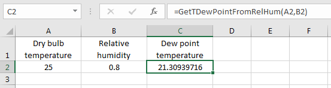

## How to use PsychroLib

The following are examples on how to use PsychroLib's `GetTDewPointFromRelHum` to calculate the dew-point temperature given dry-bulb temperature and relative humidity. For all languages make sure to choose the unit system to use (`SI` or `IP`) with the `SetUnitSystem` function, or in VBA by uncommenting the appropriate line in the code. Note that as per ASHRAE Handbook, the unit of temperature is degree Celsius for the SI version and degree Fahrenheit for the IP version.

### Python

From the python interactive shell:

```python
>>> import psychrolib
>>> # Set the unit system, for example to SI (can be either SI or IP) - this needs to be done only once
>>> psychrolib.SetUnitSystem(psychrolib.SI)
>>> # Calculate the dew point temperature for a dry bulb temperature of 25 C and a relative humidity of 80%
>>> TDewPoint = psychrolib.GetTDewPointFromRelHum(25.0, 0.80)
>>> print(f'TDewPoint: {TDewPoint} degree C')
TDewPoint: 21.309397163661785 degree C
```

### C

Create a source file for your program and include the following:

```c
#include "psychrolib.h"
// Set the unit system, for example to SI (can be either 'SI' or 'IP') - this needs to be done only once
SetUnitSystem(SI);
// Calculate the dew point temperature for a dry bulb temperature of 25 C and a relative humidity of 80%
double TDewPoint = GetTDewPointFromRelHum(25.0, 0.80);
printf("TDewPoint: %f degree C\n", TDewPoint);
```

Compile your code and execute the program, the output will be:

```
TDewPoint: 21.309397 degree C
```

### Fortran
Create a source file for your program and include the following:

```fortran
use psychrolib, only: GetTDewPointFromRelHum, SetUnitSystem, SI
! Set the unit system, for example to SI (can be either 'SI' or 'IP') - this needs to be done only once
call SetUnitSystem(SI)
! Calculate the dew point temperature for a dry bulb temperature of 25 C and a relative humidity of 80%
print *, GetTDewPointFromRelHum(25.0, 0.80)
```

Compile your code and execute the program, the output will be:

```
TDewPoint:    21.30935     degree C
```

### JavaScript

If you are  HTML, in the `<head>` section of your html page, include `<script src="psychrolib.js" type="text/javascript"></script>`. If you are using a JavaScript run-time environment (e.g. [Node.js](https://nodejs.org)) type the following from the Node.js command prompt:

```js
>>> // Import the PsychroLib
>>> var psychrolib = require('psychrolib.js')
>>> // Set unit system - this needs to be done only once
>>> psychrolib.SetUnitSystem(psychrolib.SI)
>>> // Calculate the dew point temperature for a dry bulb temperature of 25 C and a relative humidity of 80%
>>> var TDewPoint = psychrolib.GetTDewPointFromRelHum(25.0, 0.80);
>>> console.log('TDewPoint: %d degree C', TDewPoint);
TDewPoint: 21.309397 degree C
```

### Microsoft Excel Visual Basic for Applications (VBA)

From Visual Basic Editor (VBE) in Excel add the `psychrolib.bas` module. Set the unit system, for example to SI (can be either ' SI'  or ' IP' ) by uncommenting the following line in the psychrolib module:

```basic
Const PSYCHROLIB_UNITS = UnitSystem.SI
```
Then back in the worksheet, to calculate dew point temperature for a dry bulb temperature of 25 C and a relative humidity of 80%, enter the dry bulb temperature in a cell (A2), the relative humidity in another (B2; make sure to enter the humidity as a ratio, e.g. 0.8, not 80), and in a third cell (C2) enter the formula
```basic
=GetTDewPointFromRelHum(A2,B2)
```
Excel will calculate the result as 21.30939716, as shown in the example below.
<p align="center"></p>


### C# (.NET Standard)

Install NuGet package.
```
Install-Package PsychroLib
```

The unit system is specified in the Psychrometrics class constructor.  This allows for independent instances of the class in different unit systems.
```csharp
// Create instance of Psychrometrics class and specify the unit system.
var psyIP = new Psychrometrics(UnitSystem.IP);
var psySI = new Psychrometrics(UnitSystem.SI);
// Calculate the dew point temperature for a dry bulb temperature of 25 C and a relative humidity of 80%
var tDewPoint = psySI.GetTDewPointFromRelHum(25.0, 0.80);
Console.WriteLine($"TDewPoint: {tDewPoint} degree C");
>>> TDewPoint: 21.309397163329322 degree C
```


