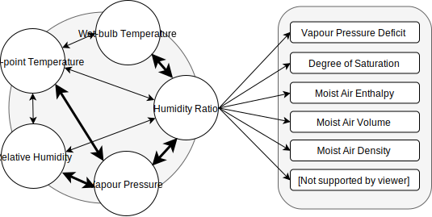

## Overview

Psychrometrics are the study of physical and thermodynamic properties of moist air. These properties include, for example, the air's dew point temperature, its wet bulb temperature, relative humidity, humidity ratio, enthalpy.

The estimation of these properties is critical in several engineering and scientific applications such as heating, ventilation, and air conditioning (HVAC) and meteorology. Although formulae to calculate the psychrometric properties of air are widely available in the literature ([@Stull2011]; [@Wexler1983]; [@Stoecker1982]; [@Dilley1968]; [@Humphreys1920]), their implementation in computer programs or spreadsheets can be challenging and time consuming.

PsychroLib is a library of functions to enable calculating psychrometric properties of moist and dry air. The library is available for Python, C, C#, Fortran, JavaScript, Microsoft Excel Visual Basic for Applications (VBA). It works in both metric (SI) and imperial (IP) systems of units. The functions are based of formulae from the  2017 ASHRAE Handbook — Fundamentals, Chapter 1, SI and IP editions. Functions can be grouped into two categories:

1. Functions for the calculation of dew point temperature, wet-bulb temperature, partial vapour pressure of water, humidity ratio or relative humidity, knowing any other of these and dry bulb temperature and atmospheric pressure.

2. Functions for the calculation of other moist air properties. All these use the humidity ratio as input.

Relationships between these various functions are illustrated in Figure 1. To compute a moist air property such as enthalpy, knowing a humidity parameter such as dew point temperature, one first has to compute the humidity ratio from the dew point temperature, then compute the enthalpy from the humidity ratio. The functions in point (1) above include primary relationships corresponding to formulae from the ASHRAE Handbook, and secondary relationships which use a combination of primary relationships to calculate the result. For example, to compute dew point temperature knowing the partial pressure of water vapor in moist air, the library uses a formula from the ASHRAE Handbook (primary relationship). On the other hand to compute dew point temperature from relative humidity, the library first computes the partial pressure of water vapor, then computes the dew point temperature (secondary relationship). Primary relationships are shown with bold double arrows in Figure 1.

<b>Figure 1</b> - Psychrometric relationships.

## Available functions

The following psychrometric functions are currently available across all the supported languages:

|Function Name|Description|
|-------------|-----------|
|`GetTRankineFromTFahrenheit`|Utility function to convert temperature to degree Rankine given temperature in degree Fahrenheit.|
|`GetTFahrenheitFromTRankine`|Utility function to convert temperature to degree Fahrenheit given temperature in degree Rankine.|
|`GetTKelvinFromTCelsius`|Utility function to convert temperature to Kelvin given temperature in degree Celsius.|
|`GetTCelsiusFromTKelvin`|Utility function to convert temperature to degree Celsius given temperature in Kelvin.|
|`GetTWetBulbFromTDewPoint`|Return wet-bulb temperature given dry-bulb temperature, dew-point temperature, and pressure.|
|`GetTWetBulbFromRelHum`|Return wet-bulb temperature given dry-bulb temperature, relative humidity, and pressure.|
|`GetRelHumFromTDewPoint`|Return relative humidity given dry-bulb temperature and dew-point temperature.|
|`GetRelHumFromTWetBulb`|Return relative humidity given dry-bulb temperature, wet bulb temperature and pressure.|
|`GetTDewPointFromRelHum`|Return dew-point temperature given dry-bulb temperature and relative humidity.|
|`GetTDewPointFromTWetBulb`|Return dew-point temperature given dry-bulb temperature, wet-bulb temperature, and pressure.|
|`GetVapPresFromRelHum`|Return partial pressure of water vapor as a function of relative humidity and temperature.|
|`GetRelHumFromVapPres`| Return relative humidity given dry-bulb temperature and vapor pressure.|
|`GetTWetBulbFromHumRatio`|Return wet-bulb temperature given dry-bulb temperature, humidity ratio, and pressure.|
|`GetHumRatioFromTWetBulb`|Return humidity ratio given dry-bulb temperature, wet-bulb temperature, and pressure.|
|`GetHumRatioFromRelHum`|Return humidity ratio given dry-bulb temperature, relative humidity, and pressure.|
|`GetRelHumFromHumRatio`|Return relative humidity given dry-bulb temperature, humidity ratio, and pressure.|
|`GetHumRatioFromTDewPoint`|Return humidity ratio given dew-point temperature and pressure.|
|`GetTDewPointFromHumRatio`|Return dew-point temperature given dry-bulb temperature, humidity ratio, and pressure.|
|`GetHumRatioFromVapPres`|Return humidity ratio given water vapor pressure and atmospheric pressure.|
|`GetVapPresFromHumRatio`|Return vapor pressure given humidity ratio and pressure.|
|`GetSpecificHumFromHumRatio`|Return the specific humidity from humidity ratio (aka mixing ratio).|
|`GetHumRatioFromSpecificHum`|Return the humidity ratio (aka mixing ratio) from specific humidity.|
|`GetDryAirEnthalpy`|Return dry-air enthalpy given dry-bulb temperature.|
|`GetDryAirDensity`|Return dry-air density given dry-bulb temperature and pressure.|
|`GetDryAirVolume`|Return dry-air volume given dry-bulb temperature and pressure.|
|`GetTDryBulbFromEnthalpyAndHumRatio`|Return dry bulb temperature from enthalpy and humidity ratio.|
|`GetHumRatioFromEnthalpyAndTDryBulb`|Return humidity ratio from enthalpy and dry-bulb temperature.|
|`GetSatVapPres`|Return saturation vapor pressure given dry-bulb temperature.|
|`GetSatHumRatio`|Return humidity ratio of saturated air given dry-bulb temperature and pressure.|
|`GetSatAirEnthalpy`|Return saturated air enthalpy given dry-bulb temperature and pressure.|
|`GetVaporPressureDeficit`|Return vapor pressure deficit given dry-bulb temperature, humidity ratio, and pressure.|
|`GetDegreeOfSaturation`|Return the degree of saturation (i.e humidity ratio of the air / humidity ratio of the air at saturation at the same temperature and pressure) given dry-bulb temperature, humidity ratio, and atmospheric pressure.|
|`GetMoistAirEnthalpy`|Return moist air enthalpy given dry-bulb temperature and humidity ratio.|
|`GetMoistAirVolume`|Return moist air specific volume given dry-bulb temperature, humidity ratio, and pressure.|
|`GetTDryBulbFromMoistAirVolumeAndHumRatio`|Return dry-bulb temperature given moist air specific volume, humidity ratio, and pressure.|
|`GetMoistAirDensity`|Return moist air density given humidity ratio, dry bulb temperature, and pressure.|
|`GetStandardAtmPressure`|Return standard atmosphere barometric pressure, given the elevation (altitude).|
|`GetStandardAtmTemperature`|Return standard atmosphere temperature, given the elevation (altitude).|
|`GetSeaLevelPressure`|Return sea level pressure given dry-bulb temperature, altitude above sea level and pressure.|
|`GetStationPressure`|Return station pressure from sea level pressure.|
|`CalcPsychrometricsFromTWetBulb`|Utility function to calculate humidity ratio, dew-point temperature, relative humidity, vapour pressure, moist air enthalpy, moist air volume, and degree of saturation of air given dry-bulb temperature, wet-bulb temperature, and pressure.|
|`CalcPsychrometricsFromTDewPoint`|Utility function to calculate humidity ratio, wet-bulb temperature, relative humidity, vapour pressure, moist air enthalpy, moist air volume, and degree of saturation of air given dry-bulb temperature, dew-point temperature, and pressure.|
|`CalcPsychrometricsFromRelHum`|Utility function to calculate humidity ratio, wet-bulb temperature, dew-point temperature, vapour pressure, moist air enthalpy, moist air volume, and degree of saturation of air given dry-bulb temperature, relative humidity and pressure.|

[@Dilley1968]: https://dx.doi.org/10.1175/1520-0450(1968)007<0717:otccov>2.0.co;2 "Dilley, A. C. (1968). On the computer calculation of vapor pressure and specific humidity gradients from psychrometric data. Journal of Applied Meteorology, 7(4), 717–719. doi:10.1175/1520-0450(1968)007<0717:otccov>2.0.co;2"

[@Humphreys1920]: https://archive.org/details/physicsofair00hump/page/n9 "Humphreys, W. J. (1920). Physics of the air. Philadelphia, PA: Pub. for the Franklin Institute of the state of Pennsylvania by J.B. Lippincott Company."

[@Stoecker1982]: https://books.google.de/books?id=PrZTAAAAMAAJ&dq "Stoecker, W., & Jones, J. (1982). Refrigeration and air conditioning. McGraw-hill international editions. New York, NY: McGraw-Hill."

[@Stull2011]: https://doi.org/10.1175/JAMC-D-11-0143.1 "Stull, R. (2011). Wet-bulb temperature from relative humidity and air temperature. Journal of Applied Meteorology and Climatology, 50(11), 2267–2269. doi:10.1175/jamc-d11-0143.1"

[@Wexler1983]: https://books.google.de/books?id=MH8URAAACAAJ "Wexler, A., Hyland, R., Stewart, R., & American Society of Heating, Refrigerating and Air-Conditioning Engineers. (1983). Thermodynamic properties of dry air, moist air and water and si psychrometric charts. Atlanta, GA: ASHRAE."
